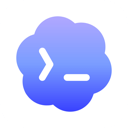
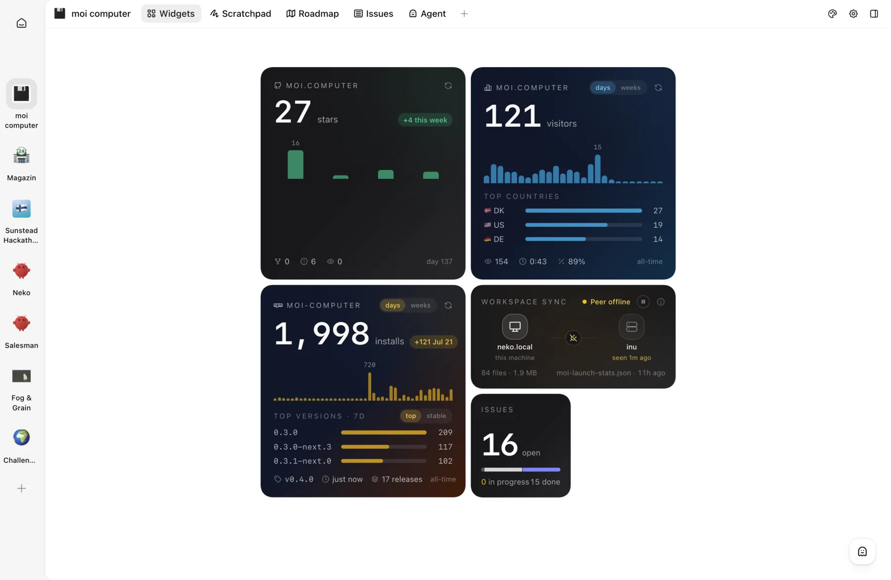
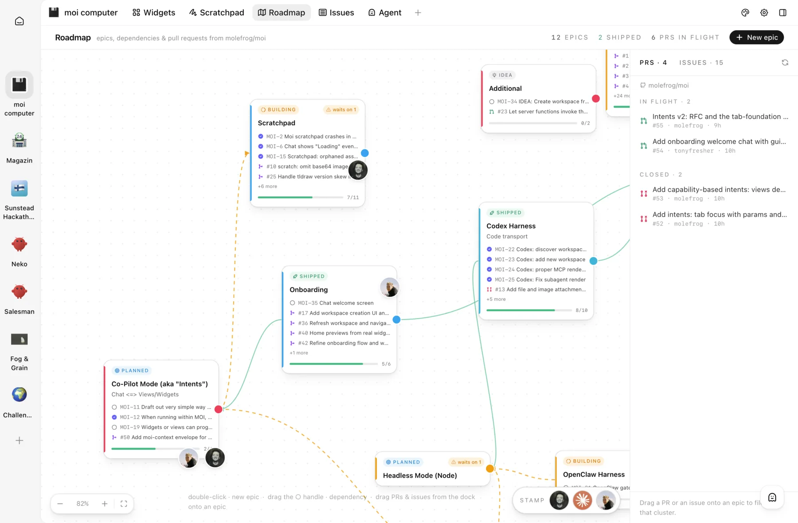
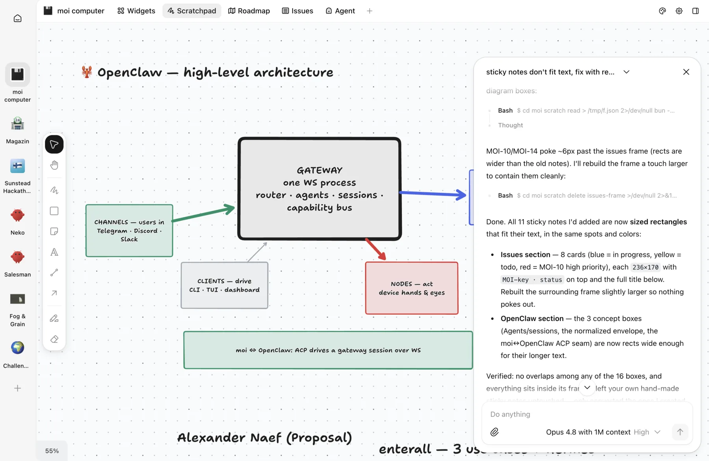
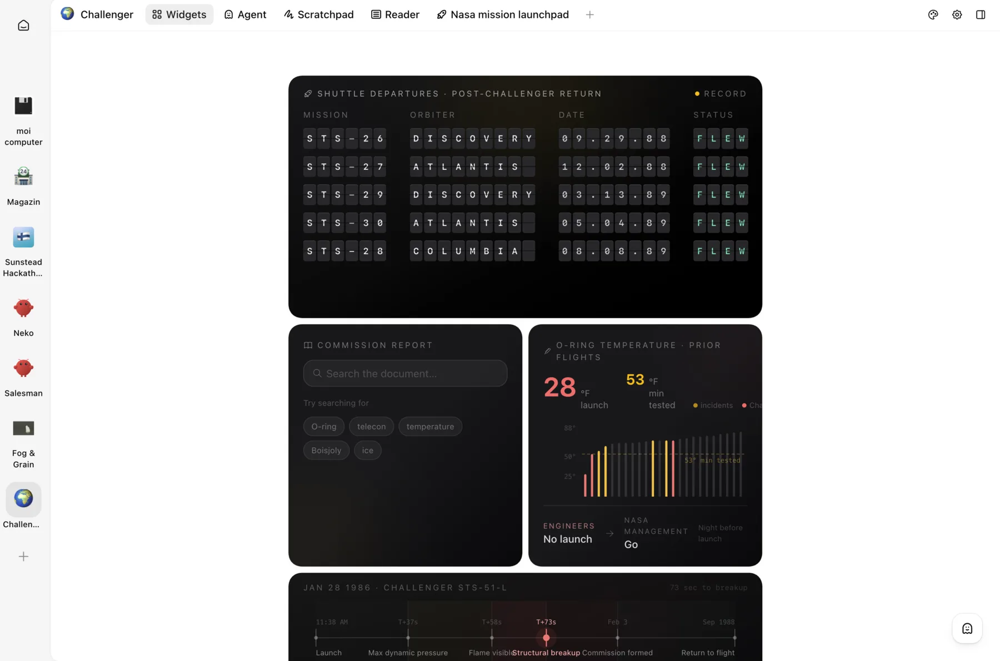
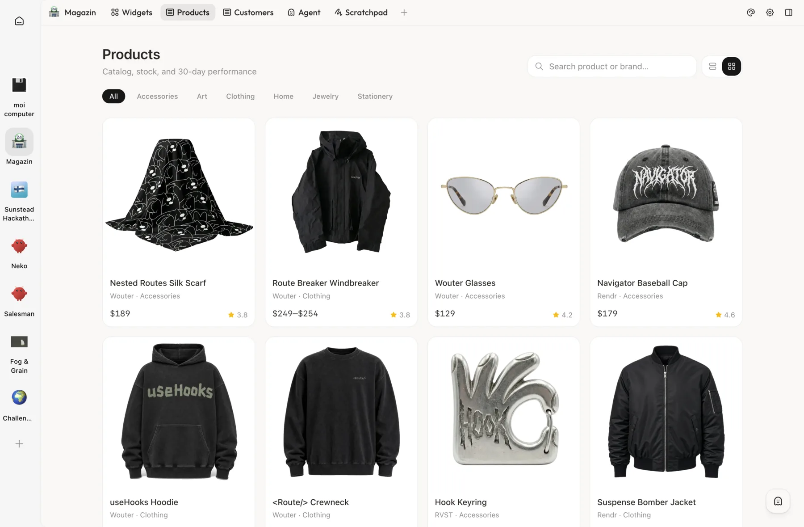
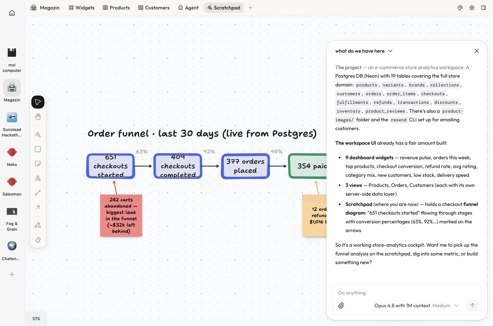
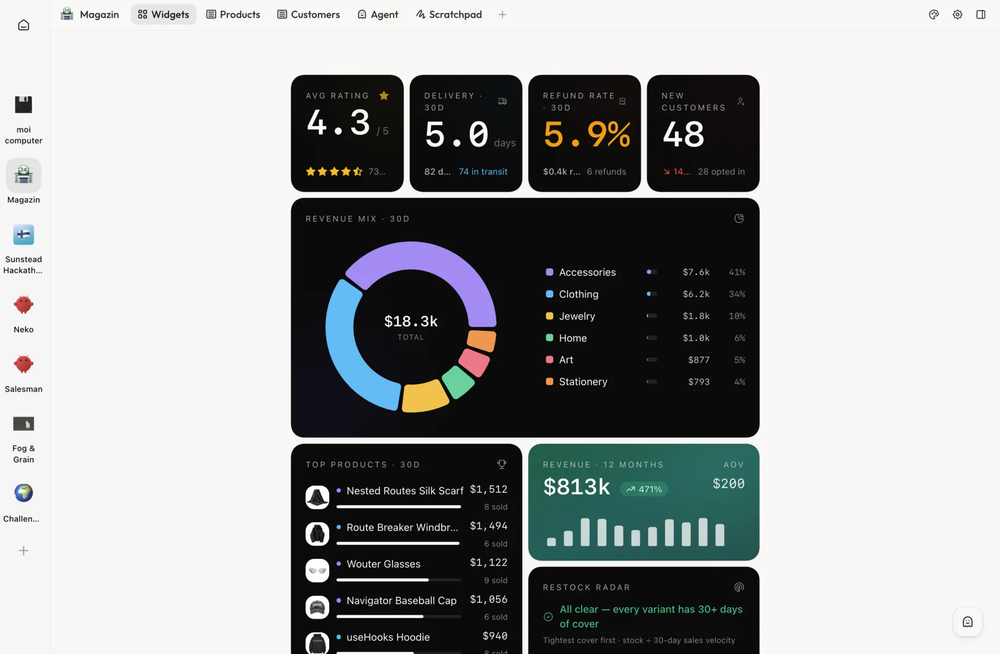
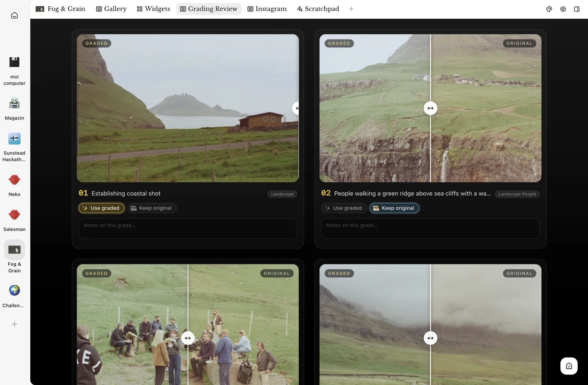

```
██████████  ██████  ██
██░░██░░██  ██░░██  ██
██░░██░░██  ██████  ██

  THE UI FOR YOUR AI
```

An extendable visual workspace where your AI agents build their own UI.
See [moi.computer](https://moi.computer) for what it is and how it works.

Moi gives your agent of choice a UI it can reshape on the fly and grow into your
personal software. Under the hood, the agent writes and embeds live components
wired to real data: APIs, local files and commands, MCP servers.

Works with the harness you already use:

|  [Claude Code](https://github.com/anthropics/claude-code) |  [Codex](https://github.com/openai/codex) |
| :------------------------------------------------------------------------------------------------------------ | :------------------------------------------------------------------------------------------- |
|  [OpenClaw](https://github.com/openclaw/openclaw)       |  Hermes _(coming soon)_                  |

# Features

- **Workspace**. The folder where your agent (e.g. Claude Code) runs and keeps
  its data. It gets a special skill that teaches it how to communicate with moi.
- **Theme**. The agent can modify the appearance of the workspace for you:
  fonts, color scheme and more.
- **Scratchpad**. A shared canvas where you ideate together with the agent: ask
  it to draw diagrams, add feedback or comments, visualize knowledge and plans.
- **Widgets**. A dynamic dashboard made of small apps wired to the data from
  your workspace. They can be rearranged, modified, and completely customized.
- **Views**. An app embedded in the workspace that lives in its own tab. Build
  complex interfaces: CRMs, task trackers, second brain storage, customer
  support views, etc.

<table>
  <tr>
    <td></td>
    <td></td>
    <td></td>
  </tr>
  <tr>
    <td></td>
    <td></td>
    <td></td>
  </tr>
  <tr>
    <td></td>
    <td></td>
    <td></td>
  </tr>
</table>

# Quick start

Using Claude Code or Codex? Paste this prompt into an existing session and the
agent will set everything up for you:

```
Set up the moi workspace for this project. Fetch https://moi.computer/CC-INSTALL.md, and follow the steps.
```

For OpenClaw or a manual setup, read on.

## Manual install

Make sure [Bun](https://bun.sh) is installed. moi uses it to run the web server and bundle the dynamic UI.

Install the `moi-computer` package from npm and start the web UI:

```sh
bun i -g moi-computer
moi start        # http://localhost:13337
```

Then bring in your project, either way works:

- open [http://localhost:13337](http://localhost:13337) and create a workspace
  (or import an existing folder) right from the web UI;
- or run `moi init` inside a folder to turn it into a workspace.

## OpenClaw

In OpenClaw, moi is installed per _agent workspace_. First, list the agents
you have:

```
> openclaw agents

🦞 OpenClaw 2026.7.1

Agents:
- main (default)   <-- the agent name you'll pass to moi
  Identity: Assistant (IDENTITY.md)
  Workspace: ~/.openclaw/workspace
  Agent dir: ~/.openclaw/agents/main/agent
  Model: openai/gpt-5.6-sol
```

Then install the moi skill into an agent's workspace and start the web UI:

```sh
moi openclaw init <agent-name>
moi start
```

Your agent's workspace will show up at `http://localhost:13337`.

## No crypto token

moi has **no** cryptocurrency, token, coin, or NFT — official or otherwise —
on any chain, and never will. Any token using the moi name, logo, or the
maintainer's name (on pump.fun, Solana, or anywhere else) is an unauthorized
scam with no affiliation to, endorsement from, or benefit to this project.
The maintainer will never announce, endorse, or accept proceeds from a token.
Don't buy it, and report it to the platform where it's listed.

License: [Elastic 2.0](LICENSE).
