```
██████████  ██████  ██
██░░██░░██  ██░░██  ██
██░░██░░██  ██████  ██

  THE UI FOR YOUR AI
```

An extendable visual workspace where your AI agents build their own UI.
See [moi.computer](https://moi.computer) for what it is and how it works.

moi gives your agent of choice a UI it can reshape on the fly and grow into your
personal software. Under the hood, the agent writes and embeds live components
wired to real data: APIs, local files and commands, MCP servers.

Works with the harness you already use:

<p align="center">
  <a href="#claude-code-and-codex"> <strong>Claude Code</strong></a>&nbsp;&nbsp;&nbsp;&nbsp;
  <a href="#claude-code-and-codex"> <strong>Codex</strong></a>&nbsp;&nbsp;&nbsp;&nbsp;
  <a href="#openclaw">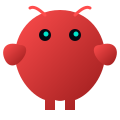 <strong>OpenClaw</strong></a>&nbsp;&nbsp;&nbsp;&nbsp;
  <a href="#hermes"> <strong>Hermes</strong></a>
</p>

# Features

- **Bring your own agent**. Connect the agent you already use.
- **Workspace**. The folder where your agent (e.g. Claude Code) runs and keeps
  its data. It gets a special skill that teaches it how to communicate with moi.
- **Theme**. The agent can modify the appearance of the workspace for you:
  fonts, color scheme and more.
- **Scratchpad**. A shared canvas where you ideate together with the agent: ask
  it to draw diagrams, add feedback or comments, visualize knowledge and plans.
- **Widgets**. A dynamic dashboard made of small apps wired to the data from
  your workspace. They can be rearranged, modified, and completely customized.
- **Views**. An app embedded in the workspace that lives in its own tab. Build
  complex interfaces: CRMs, task trackers, second brain storage, customer
  support views, etc.

<table>
  <tr>
    <td align="center">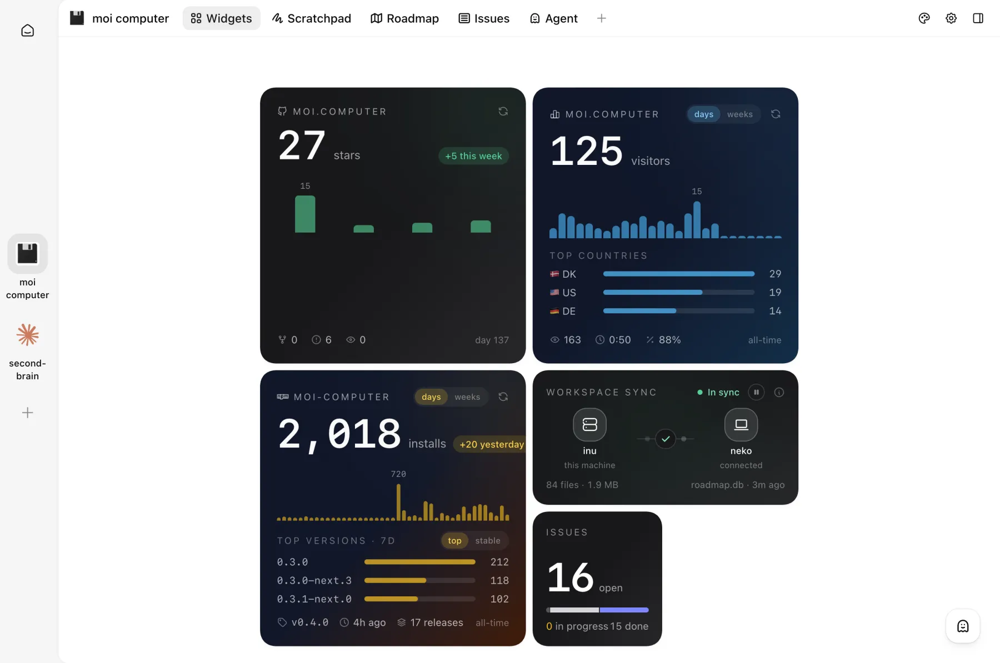<br /><sub>Widgets wired to live project stats</sub></td>
    <td align="center">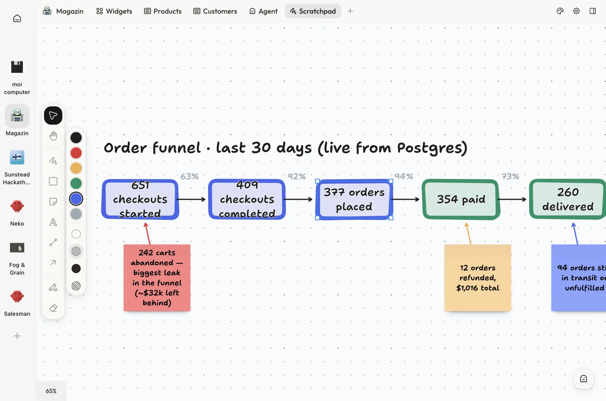<br /><sub>Order funnel on the scratchpad, live from Postgres</sub></td>
    <td align="center">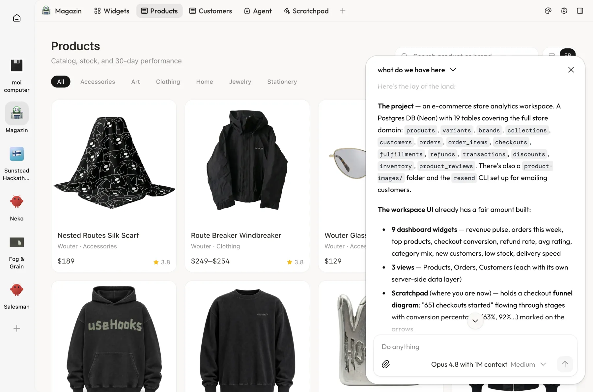<br /><sub>Use the agent as a copilot when working with products</sub></td>
  </tr>
  <tr>
    <td align="center">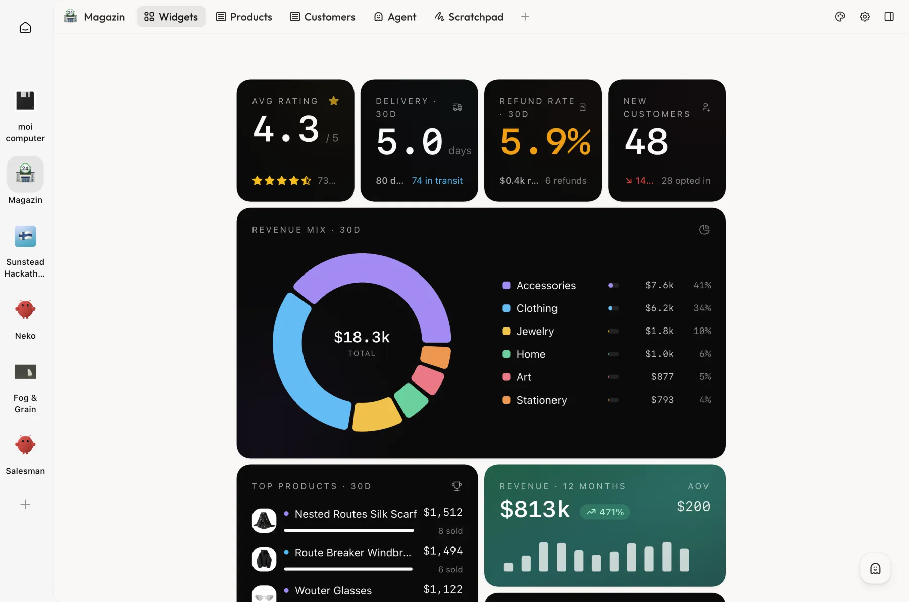<br /><sub>E-commerce store dashboard connected to Postgres and Resend</sub></td>
    <td align="center">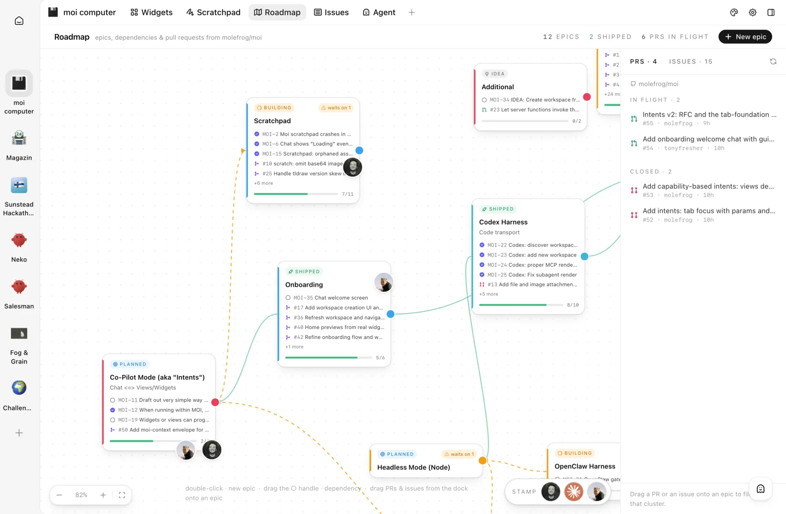<br /><sub>Build a Roadmap view with epics and pull requests</sub></td>
    <td align="center">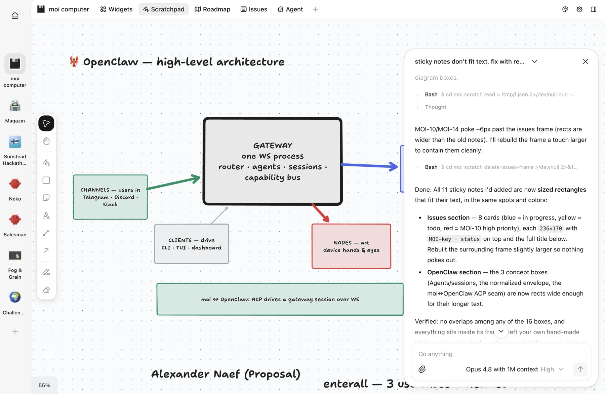<br /><sub>Sketching architecture together with the agent</sub></td>
  </tr>
  <tr>
    <td align="center">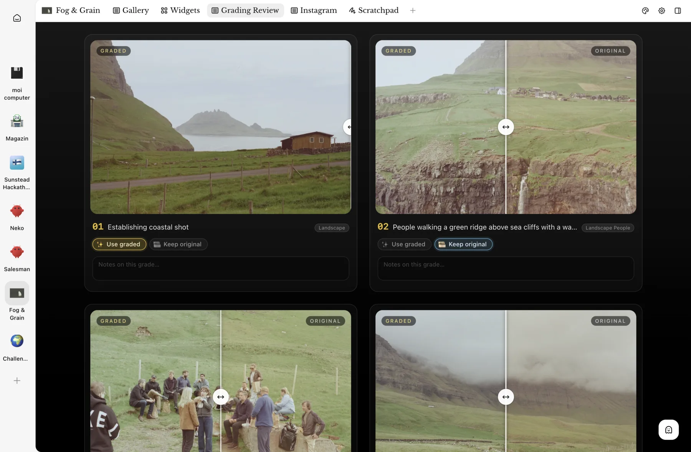<br /><sub>Custom view for color grading</sub></td>
    <td align="center">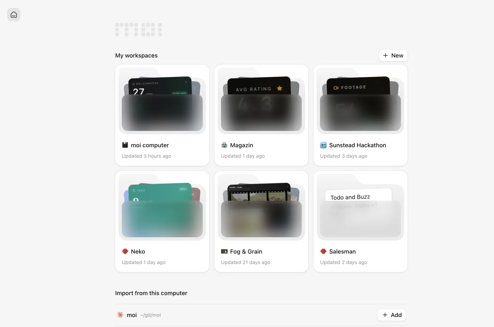<br /><sub>Home screen with your workspaces</sub></td>
    <td align="center">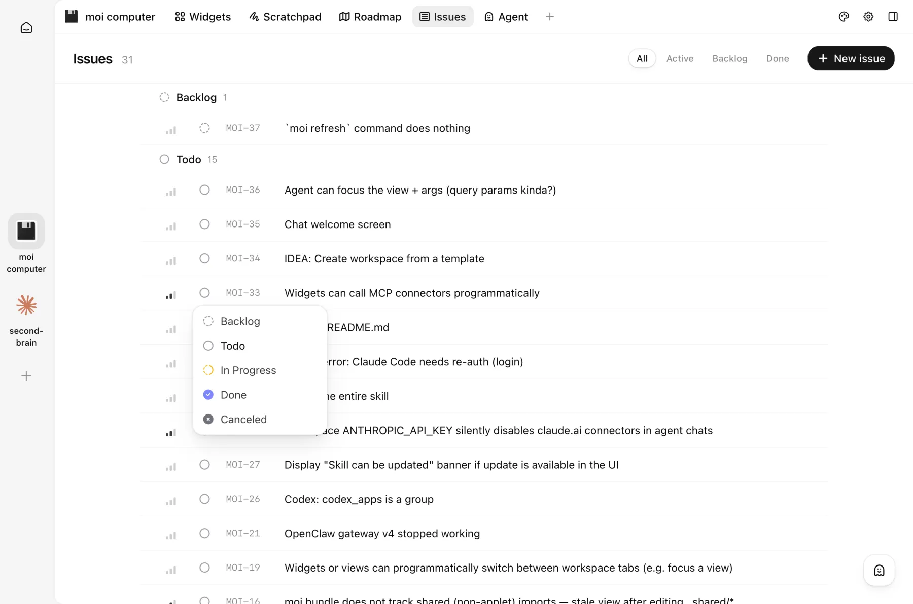<br /><sub>Issues view, a lightweight Linear-like tracker</sub></td>
  </tr>
</table>

# Quick start

Make sure [Bun](https://bun.sh) 1.3 or newer is installed. moi uses it to run the web server and bundle the dynamic UI.

Install the `moi-computer` package from npm and start the web UI:

```sh
bun i -g moi-computer
moi start        # http://localhost:13337
```

Then connect your agent: [Claude Code and Codex](#claude-code-and-codex),
[OpenClaw](#openclaw), or [Hermes](#hermes).

Learn how to:

- [Run moi as a service](#run-moi-as-a-service)
- [Update moi](#update-moi)

# How it works

moi runs locally as a CLI and web UI connected to your agent. The workspace
skill teaches the agent how to call the CLI, which updates the UI using your
files, commands, APIs, and MCP servers.

The core is `moi` command that both agent and you can use to modify the workspace.
Everything gets propagated to the UI instantly.

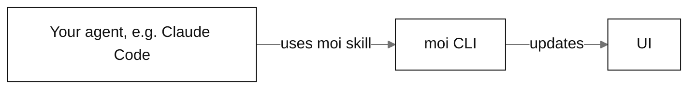
```mermaid
%%{init: {"theme": "base", "themeVariables": {"primaryColor": "#ffffff", "primaryTextColor": "#111111", "primaryBorderColor": "#111111", "lineColor": "#737373", "edgeLabelBackground": "#ffffff"}}}%%
flowchart LR
  Agent["Your agent, e.g. Claude Code"] -->|"uses moi skill"| CLI["moi CLI"]
  CLI -->|"updates"| UI["UI"]
```

Moi also stores the all widgets and views as code to keep the workspace filesystem
as a source of truth.

Updates installed from the UI restart moi and reload the browser automatically.
The app checks npm at most once an hour while it is open, retrying in five
minutes if the registry could not be reached; a closed app makes no network
calls of its own.

# Connect an agent

A workspace is the folder where your agent runs and stores its data. moi adds
a `.moi/` folder and the skills the agent needs to work with the UI.

You can connect a workspace in either of these ways:

- Open [http://localhost:13337](http://localhost:13337) and create a workspace
  or import one that moi found on your computer.
- Run `moi init` in a folder. moi detects the harness from the folder's Hermes
  profile, OpenClaw agent, or Claude Code or Codex history. If detection is
  ambiguous, it asks you to choose a harness.

## Claude Code and Codex

Open Claude Code or Codex in your project folder and paste this prompt:

```
Set up the moi workspace for this project. Fetch https://moi.computer/INSTALL.md, and follow the steps.
```

To set it up manually, run:

```sh
moi init --harness=claude-code   # or --harness=codex
moi start                       # or run moi as a service
```

The project folder becomes the workspace. You can create as many workspaces as
you need.

## OpenClaw

[OpenClaw](https://openclaw.ai/) is a self-hosted harness for running one or
more always-on agents. Its channels connect agents to Slack and other
messaging services.

moi connects each OpenClaw agent to one workspace. See the
[OpenClaw documentation](https://docs.openclaw.ai/cli/agents) to add or manage
agents.

Run `moi openclaw init` to connect your agent. If moi finds more than one, it
lists them so you can rerun the command with the agent you want:

```sh
moi openclaw init
moi openclaw init <agent>       # only needed when you have multiple agents
moi start                       # or run moi as a service
```

Your agent's workspace will show up at `http://localhost:13337`.

## Hermes

[Hermes](https://hermes-agent.nousresearch.com/) is a self-hosted personal
agent from Nous Research.

moi connects each Hermes profile to one workspace. A profile is a separate
agent identity with its own model, keys, persona, skills, and memories.

Run `moi hermes init` to connect your profile. If moi finds more than one, it
lists them so you can rerun the command with the profile you want:

```sh
moi hermes init
moi hermes init <profile>       # only needed when you have multiple profiles
moi start                       # or run moi as a service
```

The profile's workspace appears at `http://localhost:13337`. To add another,
create it with `hermes profile create <name>`, then run `moi hermes init` again.

moi connects to Hermes through its built-in
[Agent Client Protocol](https://agentclientprotocol.com/) server. It starts a
`hermes -p <profile> acp` process and communicates over stdio, so there is no
gateway, port, or additional API key to configure.

# Manage moi

## Run moi as a service

Instead of keeping `moi start` in a terminal, install moi as a user-level
service. It starts on login, restarts on crash, and survives reboots
(launchd on macOS, a systemd user unit on Linux; no root needed):

```sh
moi service install     # install and start
moi service             # state, unit path, server version
moi service logs -f     # follow server logs
moi service restart
moi service uninstall
```

Anything your agents need belongs in the workspace env (`moi env set` or
`.env`). To capture shell variables instead, run
`moi service install --env MY_TOKEN,OTHER`.
Rerun `moi service install` after changing captured vars (or moving bun). On
macOS the first install may show a "background item added" notification for
"moi"; that is the moi service. On headless Linux, lingering is enabled
automatically when possible so the service outlives your SSH session.

## Update moi

```sh
moi update            # update to the latest release
moi update --check    # only check; exit 0 up to date, 1 update available, 2 check failed
```

`moi update` checks npm for the latest release and updates through whichever
package manager owns the install (bun, npm, pnpm, or yarn). A service-managed
server is restarted onto the new version; a foreground `moi start` only gets
a warning, so restart it yourself. Prerelease installs (`…-next.N`) are left
alone. `--check` changes nothing and is made for scripts and agents.
`moi status` shows when the running server and CLI versions differ, however
the update happened.

# No crypto token

moi has **no** cryptocurrency, token, coin, or NFT, official or otherwise, on
any chain, and never will. Any token using the moi name, logo, or the
maintainer's name (on pump.fun, Solana, or anywhere else) is an unauthorized
scam with no affiliation to, endorsement from, or benefit to this project.
The maintainer will never announce, endorse, or accept proceeds from a token.
Don't buy it, and report it to the platform where it's listed.

License: [Elastic 2.0](LICENSE).
