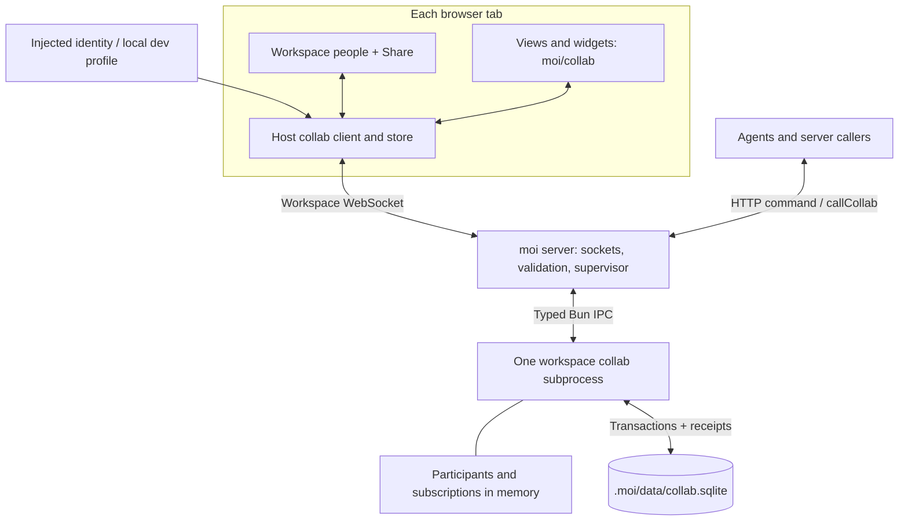
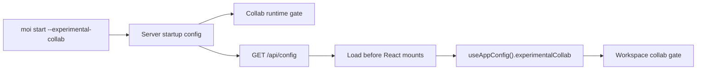
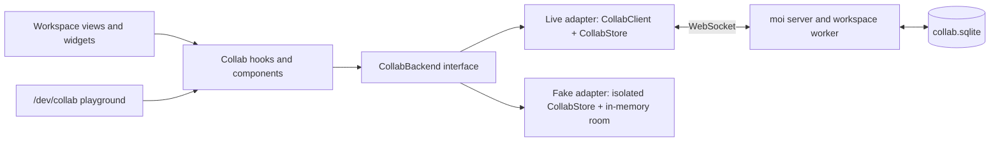

# collab: experimental collaboration

Status: experimental implementation. Updated 2026-09-21 to describe the startup config,
people directory, backend interface, and dev playground.

## Scope and ownership

collab adds workspace presence and small, persistent shared values for roughly ten people using
**the same running moi workspace**. Each active workspace gets a dedicated Bun subprocess. It owns
presence, subscriptions, write ordering, and SQLite; the main server owns browser sockets and
supervision. Applets import `moi/collab` and share the host's connection and React context.

Identity is supplied by an **injected browser script**: `{ id, name, color, avatar? }`, or explicitly
through the local dev profile page. The server validates its shape and limits, assigns a connection
id, and remembers supplied profiles in a workspace people directory. This lets applets resolve
names and avatars after someone leaves. The outer product owns identity authority, authentication,
and workspace access policy. Names and ids are attribution, not access credentials.



## Enable and install

Runtime availability and document installation are independent CLI choices:

| Command                                 | Behavior                                                                                  |
| --------------------------------------- | ----------------------------------------------------------------------------------------- |
| `moi start --experimental-collab`       | Enables the collab runtime for every workspace served by this process.                    |
| `moi start --dev --experimental-collab` | Enables the same runtime under the dev supervisor.                                        |
| `moi start`                             | Leaves the runtime disabled, including after a previous flagged start.                    |
| `moi init --experimental-collab`        | Initializes the current workspace with the optional collaboration guide and applet types. |

The launcher passes its explicit choice to child processes. Dev mode does not enable collab
automatically. Workers start lazily when a caller needs them. Restarting without the flag disables
runtime and preserves shared data and documents.

### Startup configuration

`experimentalCollab: boolean` is part of the existing client startup config from `GET /api/config`.
The server resolves it from the CLI's process setting, alongside the other client-safe startup
values. Both the server runtime gate and the browser read the same startup configuration.

`client/index.tsx` loads this configuration in parallel with the main bundle and awaits it before
mounting React. `useAppConfig()` exposes it synchronously from the first render and refreshes it
when the workspace-event socket reconnects after a server restart. The collab gate reads it
directly; it does not wait for the workspace layout query or make a separate config request.

The existing workspace response includes only an optional `collabReference` path, when the guide
has been installed and the runtime is available. This is workspace metadata for agent context;
it does not enable the runtime. `moi start --experimental-collab` is the only runtime opt-in.



Installation adds:

- `<workspace skill directory>/moi-workspace/references/COLLABORATIVE.md`.
- `.moi/collab-env.d.ts`, declaring the `moi/collab` imports.

The main `SKILL.md` stays unchanged. The uppercase reference ships in the package but lives outside
the default templates; only explicit CLI init installs it. Ordinary init, UI provisioning and skill
refreshes do not add it, and preserve a previously installed copy. `init --web --experimental-collab`
installs the documents but does not implicitly enable runtime. Chat/view-builder context points to
the installed reference when runtime is available.

Starting the runtime does not set identity or show workspace Share/people controls. Identity starts
as `null`. Shared-state hooks can connect anonymously: those connections are omitted from people
lists and do not publish location or presence. Merely opening an ordinary workspace does not open
a collab socket until an applet requests shared state or an identity is explicitly supplied.

The combined `/dev/collab` page offers optional dev identity setup when no external identity
provider is configured. Select **Use dev identity** to save a name, preset color, and facehash-style
avatar rasterized to a PNG data URL of at most 8 KiB. The profile stays in that tab's
`sessionStorage`; **Save identity** applies later edits. Opening the playground does not create an
identity. Only a supplied identity activates workspace presence, host controls, and personal
navigation.

An injected outer getter or a call to the bridge's `setIdentity` claims external-provider ownership.
This remains true when the provider returns `null` or signs out. Dev identity controls are hidden,
and pending dev edits cannot overwrite the provider. The simulated playground remains available.

## Browser identity and sharing bridge

When collab loads it installs `window.moi.collab` with:

```ts
getIdentity(): Identity | null
setIdentity(identity: Identity | null): void
subscribeIdentity(listener: (identity: Identity | null) => void): () => void
setShareHandler(handler: ((context: {
  workspaceId: string
  url: string
}) => Promise<{ url: string }>) | null): void
```

Subscriptions receive the current identity immediately. The workspace provider dispatches
`moi:collab-ready`; an outer script can also supply `getIdentity` before moi loads. Example script:

```js
const profile = { id: 'anna', name: 'Anna', color: '#7c3aed' }
window.moi ??= {}
window.moi.collab ??= { getIdentity: () => profile }

let attached = false
function attachCollab() {
  const collab = window.moi.collab
  if (attached || !collab.setIdentity) return
  attached = true
  collab.setIdentity(profile)
  collab.subscribeIdentity(identity => {
    console.log('Current participant:', identity?.name ?? 'Signed out')
  })
  // Replace this function with the outer product's share-link service.
  collab.setShareHandler(async ({ url }) => ({ url }))
}
window.addEventListener('moi:collab-ready', attachCollab)
attachCollab()
```

A same-id profile change updates its display information. A different id reconnects; `null`
ends named presence while shared-state applets can continue anonymously. The host Share button
calls the supplied handler and copies its returned HTTP(S) URL.
Without a handler it copies the existing workspace URL. This does not publish the workspace,
create invitations, or grant access; the recipient must already be able to reach the server.

## Applet API

No applet-facing provider, socket, npm package, or identity setup is needed. The host passes its
actual API/context objects through the existing applet bridge so separately bundled applets share
one store. Applet scopes organize data; they do not isolate untrusted code.

| API                                              | Current contract                                                                                  |
| ------------------------------------------------ | ------------------------------------------------------------------------------------------------- |
| `useSelf()`                                      | Participant or `null`; fields: `identity`, `connectionId`, `location`, `presence`.                |
| `useOthers({ scope? })`                          | Other connections on the current `page` by default; `workspace` includes all pages.               |
| `usePerson(id)`                                  | `{ id, identity, status }`; status is `active`, `away`, or `offline`; unknown identity is `null`. |
| `usePresence(channel, initialValue)`             | `{ value, setValue, others }`; set replaces the whole transient channel value.                    |
| `useSharedState(key, { scope?, defaultValue? })` | `{ value, exists, loaded, canWrite, isSaving, error, setValue, deleteValue }`.                    |
| `useSharedStore(prefix?, { scope? })`            | Prefix-relative `entries`, `set`, `delete`, `batch`, and the same loading/save status fields.     |

`location` is `{ page, title? } | null`; the host currently reports the route's page segment and
uses `null` when the browser tab is hidden. One user may have multiple connections/locations.
`Activity` deduplicates avatars by `identity.id`.

| Component       | Props                                                                          |
| --------------- | ------------------------------------------------------------------------------ |
| `Activity`      | Optional `scope="page"` or `"workspace"`, `className`.                         |
| `Cursors`       | `children`, optional stable `surface` name and `className`.                    |
| `PresenceField` | Stable `target`, `children`, optional `className`; advisory focus, no locking. |
| `Selection`     | Stable `target`, local `selected` boolean, `children`, optional `className`.   |

People components take a person by id only, as `id` for one person and `ids` for several, and resolve
the current name, face, and status through the workspace: `Person` (with `avatarOnly`), `Facepile`,
`Cursor`, `PresenceFrame`, `PresenceGutter` (entries of `{ id, target }`), and the `usePerson` hook.
Live connections answer first, then the people directory, then the local profile. An unknown id
renders as "Unknown person".
The green dot (`showStatus`, on for `Person`, off for `Facepile`) marks a person with the workspace open
in a visible tab. `PresenceFrame`, and with it `PresenceField` and `Selection`, hugs the single element
it wraps and copies its corner radius, so callers pass no size or rounding.
There is no save-status component; applets render `isSaving` and `error` from the shared-state hooks.

The complete applet contract and examples live in
[COLLABORATIVE.md](../server/collab/skill/references/COLLABORATIVE.md); the matching declarations
live in [collab-env.d.ts](../server/collab/skill/collab-env.d.ts).

```tsx
const title = useSharedState<string>('task/42/title', {
  scope: 'shared:tasks',
  defaultValue: ''
})
// Wait for title.loaded; disable editing while !title.canWrite.
const outcome = await title.setValue('Ship demo')
// outcome: { status: 'committed', revision }
//       or { status: 'rejected' | 'unknown', message }
```

`defaultValue` is a read fallback after hydration, never an initialization write. Save methods
return outcomes; an applet must show errors and preserve drafts on `unknown`. The default data
scope is `applet:<kind>:<name>`, such as `applet:view:board`. Renaming changes that default; use a
stable explicit scope when multiple applets or renamed views share data.

Presence belongs to each mounted hook registration. Hidden views, outgoing builds, unmounts, and
Strict Mode cleanup release their registrations/subscriptions. Cursor updates are coalesced to
50 ms. Semantic `data-collab-target` anchors support differing layouts; arbitrary canvas coordinate
mapping is not implemented.

## Frontend backends and dev playground

Hooks and components consume the [CollabBackend](../client/features/collab/backend.ts) interface
through context. It exposes connection and people snapshots, viewer identity, location, presence,
and scoped shared state. `CollabWorkspaceProvider` supplies the live adapter around `CollabClient`.
Host development pages and tests can supply another implementation through `CollabBackendProvider`.
Applets receive their provider from the host.



The single **Collab** entry on `/dev` opens `/dev/collab`. It combines optional dev identity
controls with the component gallery and interactive hook playground. The old `/dev/collab-kit`
URL redirects to this page. Production builds redirect `/dev` to the home page.

Run `bun run dev` to use the playground. It requires no workspace, installed collaboration guide,
runtime flag, or real identity. Dev identity controls affect real workspace identity; the playground
keeps its own sample people and room. To test a real workspace connection, start with
`moi start --dev --experimental-collab` and supply identity when testing named presence.

[DevCollabPage.tsx](../client/features/collab/DevCollabPage.tsx) composes the conditional
[dev identity form](../client/features/collab/DevCollabIdentity.tsx) and the
[playground](../client/features/collab/DevCollabKit.tsx):

- People, facepiles, outlines around different controls, document gutters, and cursor examples.
- Connected `Activity`, `Cursors`, `PresenceField`, and `Selection` examples with scripted people.
- Live hook results for self, page/workspace participants, known and unknown people, and custom
  presence. Shared note edits simulate another participant; task actions exercise atomic batches.
- Simulated 400 ms saves make optimistic changes and saving status visible.

[createFakeBackend](../client/features/collab/fake-backend.ts) uses the real `CollabStore` with an
in-memory room. It supplies snapshots and updates, simulated participants, and remote mutations
without opening a collab socket or writing SQLite. Each playground mount gets a new room, so
edits reset on remount and separate browser tabs have independent rooms. This exercises component
and client-store behavior; transport, worker recovery, receipts, and persistence have separate
integration tests.

## Storage and recovery

The worker uses `bun:sqlite` with `scopes`, `entries`, `receipts`, and `people` tables, one synchronous
connection, rollback journal mode, `synchronous=EXTRA`, and versioned migrations. Schema version 2
adds the people table to version 1 databases while preserving existing shared values and receipts.

- The people directory stores supplied profiles by identity id. The worker upserts profiles on join
  and on changes, includes a directory snapshot in `welcome`, and announces changed profiles in
  `people` messages. Disconnect removes live presence while retaining remembered profiles.
- Directory snapshots include up to 500 profiles ordered by their last profile change. This is a
  query limit; stored rows are not pruned. Rejoining with an unchanged profile does not change its
  order. Profiles carry no version, so stale tabs sharing an identity can supply older information.
- Values are plain JSON at `(scope, key)`. `set`, `delete`, and ordered atomic batches are supported.
- Last **server-committed** write to the same key wins. Different field keys remain independent.
- Whole scopes receive snapshots and ordered updates; prefix filtering happens in the client.
- Each scope has a monotonic revision. Subscribing captures/registers synchronously before later writes.
- A transaction writes values, advances the revision, and stores an actor/operation receipt together.
- Receipts last 24 hours. Reusing an operation id with the same payload does not reapply it;
  changed payloads fail. Missing/expired receipts mean unknown, not failed.
- The client keeps optimistic edits separately, reconnects with fresh subscriptions/snapshots, and
  looks up uncertain operation ids. It never automatically replays offline or unknown edits.

Limits: 100 operations per mutation, 64 KiB per value, 256 KiB per request, and 10 MiB/10,000 entries
per scope. Use a membership key such as `task/<id>/exists` plus separate title/done keys. Creation
batches membership and fields; deletion removes membership. A late field write cannot then make
the item visible again. Strings, arrays, and objects are replaced as whole values.

```mermaid
sequenceDiagram
  participant C as Host client
  participant M as moi server
  participant W as Workspace worker
  participant D as SQLite
  C->>M: Mutate(scope, operationId, operations)
  M->>W: Validated command + actor
  W->>D: Commit values + revision + receipt
  D-->>W: Committed
  W-->>M: Ordered subscriber updates and acknowledgment
  M-->>C: Apply committed update; settle pending edit
  Note over C,D: Lost acknowledgment: reconnect, refresh snapshot, query receipt; never replay blindly.
```

The database is durable workspace content, not a cache. Do not edit it from applets/functions or
copy a changing file for backup. Internal export creates a consistent copy without overwriting an
existing destination. Git cannot merge independently edited SQLite files.

## Agents and server callers

`POST /api/workspaces/:id/collab/command` accepts supplied actor attribution and one command:

```json
{
  "actor": { "kind": "agent", "id": "workspace-agent" },
  "command": {
    "type": "mutate",
    "scope": "shared:tasks",
    "operationId": "a-new-unique-operation-id",
    "operations": [{ "type": "set", "key": "task/42/done", "value": true }]
  }
}
```

Other HTTP commands are `{ "type": "snapshot", "scope": "shared:tasks" }` and
`{ "type": "receipts", "operationIds": ["..."] }`. Actors have `id` and `kind` (`user`, `agent`,
`system`); receipts are isolated by actor kind/id. These operations use the same worker and
broadcast to subscribed browsers. HTTP rejects filesystem export commands.

Internal moi server code can use the same service directly:

```ts
import { callCollab } from './collab/manager'

const actor = { id: 'workspace-agent', kind: 'agent' as const }
await callCollab(workspacePath, actor, { type: 'snapshot', scope: 'shared:tasks' })
await callCollab(workspacePath, actor, { type: 'export', path: destinationPath })
```

Applet server functions can call the HTTP endpoint; there is no dedicated server-side
`moi/collab` import or automatic requesting-user propagation in this release. Never open the shared
SQLite file as a second writer.

## Lifecycle and personal UI

The parent lazily starts one worker per canonical workspace path. Concurrent starts share one
owner. Workers remain alive while connections/requests exist and stop after 60 seconds idle.
Startup has a 10-second timeout; graceful shutdown has a 2-second forced-termination deadline.
The server expires idle connections after 60 seconds; the client sends a heartbeat every 15 seconds.

On worker failure the parent closes its collab sockets. Reconnection backs off, obtains fresh
snapshots, and restores presence. Parent shutdown closes SQLite and children; parent IPC loss also
terminates the child. Applet rebuilds and function-worker restarts leave collab running. Active
workers are never evicted by an LRU limit. Only one moi server may own a workspace directory.

With an explicitly supplied identity and an enabled runtime, current/open tabs and chat selection
are browser-tab-local state. CLI/server `tab:focus` broadcasts are intentionally ignored;
there is no targeted remote navigation command yet. Applet `focusTab` stays local and works.
Without an explicit identity, navigation retains its existing behavior even when the runtime is
available. Layout saves omit tabs unless navigation deliberately updates them, preserving authored
defaults during unrelated grid/theme changes. Global startup config refreshes when the
workspace-event connection reconnects after a server restart.

The workspace header stacks the faces of up to three other people, a count for the rest, and you
with a chevron. Hovering a face names the person and the tab they are on; selecting it opens that
tab. The chevron opens the people list: you first, then in development a button to change your
name or avatar, then everyone else with their tab named with the workspace's own labels and icons.
A green dot marks a visible browser tab; a person whose tabs are all hidden is Away. Selecting a
row opens the tab they are on.

## Verification

The dev kit is the maintained manual playground. Automated coverage is colocated with the code:

| Area                                                                                                                                                                            | Coverage                                                                                                             |
| ------------------------------------------------------------------------------------------------------------------------------------------------------------------------------- | -------------------------------------------------------------------------------------------------------------------- |
| [Storage](../server/collab/storage.test.ts) and [service](../server/collab/service.test.ts)                                                                                     | Conflicts, atomic rollback, receipt recovery, snapshots, profile persistence, schema migration, and broadcasts.      |
| [Client store](../client/features/collab/store.test.ts), [people](../client/features/collab/people.test.ts), and [fake backend](../client/features/collab/fake-backend.test.ts) | Optimistic edits, acknowledgment ordering, identity resolution, disconnect retention, presence, and simulated saves. |
| [Client transport](../client/features/collab/client.test.ts) and [worker manager](../server/collab/manager.test.ts)                                                             | Connections, real WebSockets, workspace isolation, crashes, lost acknowledgments, and parent-death cleanup.          |
| [Startup config](../server/app-config.test.ts), [HTTP](../server/collab/http.test.ts), and [CLI flags](../server/test/cli-collab.test.ts)                                       | Process opt-in, runtime gating, anonymous shared state, and optional document installation.                          |
| [Applet declarations](../server/collab/skill/index.test.ts) and [personal navigation](../client/features/collab/personal-state.test.ts)                                         | Public API compatibility, guide installation, and browser-tab-local navigation.                                      |

Use the dev kit for visual and hook behavior checks. Real multi-browser verification uses an
explicitly enabled workspace and covers synchronization, reconnects, durable reloads, and Share
behavior through the live backend.

## Current boundaries

Remaining boundaries: no cloud authentication/access enforcement, invitations, deployment service,
per-field permissions, offline synchronization, independent replicas, collaborative text, atomic
counters, activity history, follow mode, or comments/mentions. Existing host HTTP/chat/event surfaces
still assume a trusted installation. Hosted access enforcement belongs to the outer product.

## References

- [Liveblocks presence](https://liveblocks.io/docs/products/sync/presence) and [React API](https://liveblocks.io/docs/api-reference/liveblocks-react): inspiration for separate identity/presence and applet hooks.
- [Liveblocks storage](https://liveblocks.io/docs/guides/how-to-use-liveblocks-storage-with-react): stronger collaborative structures than this intentionally limited LWW store.
- [Bun IPC](https://bun.sh/docs/runtime/child-process), [WebSockets](https://bun.sh/docs/runtime/http/websockets), and [SQLite](https://bun.sh/docs/runtime/sqlite): runtime primitives.
- [SQLite transactions](https://www.sqlite.org/lang_transaction.html) and [durability settings](https://www.sqlite.org/pragma.html#pragma_synchronous): commit behavior.
- [React Activity](https://react.dev/reference/react/Activity): hidden-view state and effect lifecycle.
