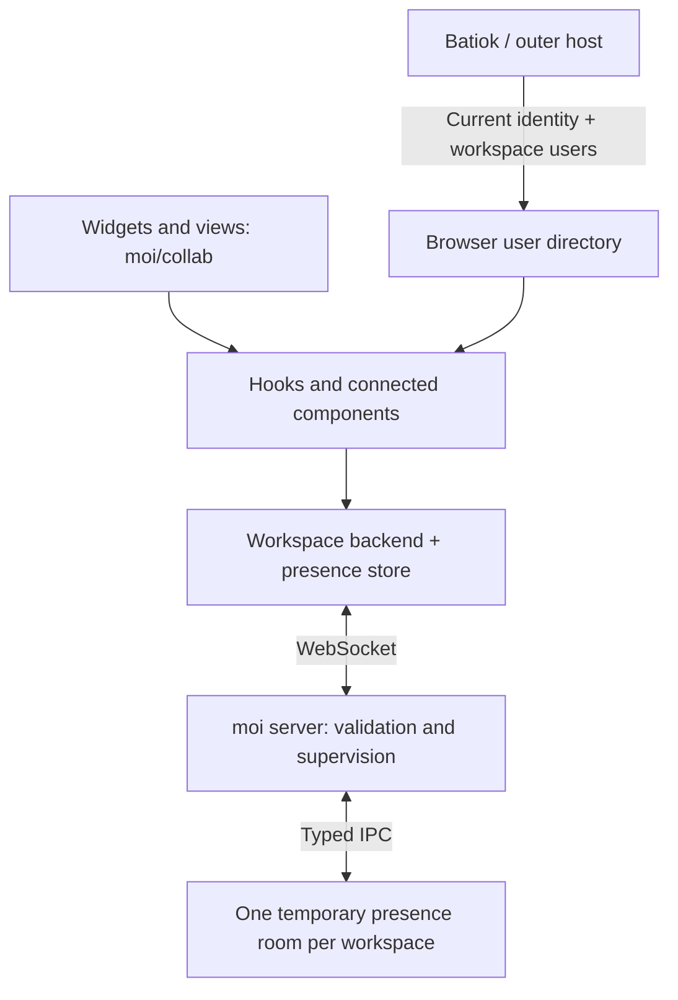

# collab: experimental presence

Status: experimental implementation, updated 2026-09-25.

## Scope

collab supplies workspace users, live presence, cursors, focus, and selection to widgets and
views through `moi/collab`. Everyone connects to the same running moi server. A workspace has
one supervised presence subprocess; it keeps connections and presence in memory only.

Persistent shared applet data and realtime query/mutation synchronization are outside this PR.
There is no collaboration database, mutation endpoint, optimistic write queue, or receipt API.
Existing experimental `.moi/data/collab.sqlite` files are left untouched and are no longer opened.

The existing applet bridge passes the host's actual hook and component functions into each
separately compiled bundle. Those functions read the host's workspace and applet React contexts.
There is one client per mounted workspace, shared by its applets. `CollabBackend` is the seam
between hooks and the live transport; the development playground supplies a fake backend.

## Enable and install

- `moi start --experimental-collab` enables live presence for this server process.
- `moi start --dev --experimental-collab` enables it under the dev supervisor.
- `moi start` disables live presence, even after a previously enabled start.
- `moi init --experimental-collab` separately installs the optional applet guide and types.

Only command-line flags enable collaboration; environment variables and config files cannot enable it.
The launcher forwards the runtime flag to its child server, including after development and update restarts.
Startup configuration exposes `experimentalCollab` through `/api/config`. The app loads it before
React mounts and refreshes it on workspace-event reconnect. Workers start lazily.

The API remains available with presence disabled: applets still render, user profiles can resolve,
peer/presence lists are empty, and publication is inert. No presence socket is opened. A mounted
applet gets the same context shape in either mode.

Identity starts as `null`. Local development uses an explicit profile from `/dev/collab`, stored
in that browser tab's `sessionStorage`. An outer provider owns identity once injected, including
when it signs out. Applets cannot set identity. Without an identity there is no presence connection.

## Users and connections

A user profile is `{ id, name, color, avatar?, email? }`. IDs are stable attribution identifiers;
profiles and browser injection do not provide authentication or workspace access enforcement.
Those policies remain the outer host's responsibility.

A connection is `{ connectionId, userId, location, presence }`. One user can have multiple browser
tabs. The server assigns connection IDs. `location` is `{ page, title? } | null`, with `null` for
hidden tabs. A page is the route segment within the workspace. Status is aggregated across a
user's workspace connections:

- `active`: at least one visible connection.
- `away`: connected, but all connections are hidden.
- `offline`: no connection in this workspace.

Being on a different page does not make someone offline. `usePeers()` defaults to the current
page, deduplicates by user ID, and excludes the current user across all their connections.
`scope: 'workspace'` includes other pages and hidden connections. Status filters are optional.
Presence values remain per connection and exclude only the observing connection, so another tab
of the same user can still have its own pointer.

Batiok's full workspace directory is authoritative when supplied. It allows resolving an offline
user, including someone who has never opened the workspace. Profile replacement and removal take
effect immediately; live connections cannot resurrect removed directory entries. With no host
directory, current connection profiles and the local identity provide a development fallback.
This fallback is transient and makes no promise of resolving users after they leave.

The complete host integration contract and bootstrap example are in
[batiok-collab-bridge.md](batiok-collab-bridge.md).

## Applet API

| Hook                                 | Contract                                                                                                          |
| ------------------------------------ | ----------------------------------------------------------------------------------------------------------------- |
| `useMe()`                            | Current user profile plus `status`, or `null`.                                                                    |
| `useUser(id)`                        | A profile plus `status`, including offline users; `null` for unknown IDs.                                         |
| `useWorkspaceUsers({ status? })`     | Complete workspace directory, including self and offline members; optional `active`, `away`, or `offline` filter. |
| `usePeers({ scope?, status? })`      | Other connected users; `scope` is `page` or `workspace`, `status` is `active` or `away`.                          |
| `usePresence(channel)`               | Read-only array of `{ connectionId, userId, value }` for other connections on this page and applet surface.       |
| `usePublishPresence(channel, value)` | Publish the current JSON value reactively while mounted and visible. Returns nothing.                             |

Reading presence never creates a presence registration. Publication owns one registration per
mounted hook and replaces that registration's whole value. Hidden views, browser tabs, outgoing
builds, unmounts, and Strict Mode cleanup release registrations. Presence is restored after reconnect.
Custom channel names are scoped by applet surface (`view:<name>` or `widget:<name>`); they are not
a persistent key/value store. Channel values must be JSON and fit within 4 KiB.

| Component        | Contract                                                                                       |
| ---------------- | ---------------------------------------------------------------------------------------------- |
| `User`           | Resolve a profile by `id`; name/avatar, sizes, optional status and detail.                     |
| `Facepile`       | Resolve `ids` and render stacked avatars with an overflow count.                               |
| `Activity`       | Show current-page or workspace participants.                                                   |
| `Cursors`        | Wrap a cursor surface; optional stable `surface` name.                                         |
| `PresenceFrame`  | Wrap a control with `target`; `each` tracks each keyed direct child of a list/form.            |
| `PresenceGutter` | Same contract, with an avatar beside the focused item; `each` also scopes its animation group. |
| `PresenceGroup`  | Optionally group gutter targets to constrain avatar layout animations.                         |
| `Selection`      | Wrap a `target` and supply a controlled `selected` boolean.                                    |

Frame and gutter do not accept user IDs. They discover focus through presence and share the same
target channel. Nested focus belongs to the nearest target wrapper. Use semantic targets such as
`todo:42:title`, never array positions or inferred DOM paths. Reusing a modal for another record
must change its target. Scope animation groups to related list/form regions.

With `each`, a single frame or gutter wraps a list/form and creates indicators for its keyed direct
children, including composed components with nested controls. Each child must have a unique,
explicit semantic React key. The target is `groupTarget + '/' + encodeURIComponent(childKey)`;
reordering keeps presence attached to its data and removal releases it. Empty children are ignored;
unkeyed elements, duplicate keys, and bare text are rejected. A keyed fragment is one target.
The group's `className` controls layout. `PresenceGutter each` owns its animation group automatically.
Default single-target mode and explicit `PresenceGroup` remain available for individual controls.

`useWorkspaceUsers` enumerates the full host directory, while `usePeers` enumerates connections
deduplicated by user. The workspace header shows connected users (active or away) only; its member
popover can list offline users too. Without a host directory, enumeration falls back to the local
identity and currently connected profiles, so it cannot discover offline members.

`Cursors` is the public cursor component; the singular cursor renderer is internal. Pointer updates
are coalesced to 50 ms. Optional `data-collab-target` anchors allow pointers to follow an element
when layouts or scroll positions differ; arbitrary canvas coordinate mapping is not implemented.

Public declarations: [collab-env.d.ts](../server/collab/skill/collab-env.d.ts).
Authoring guide: [COLLABORATIVE.md](../server/collab/skill/references/COLLABORATIVE.md).

## Transport and lifecycle

Protocol version 2 accepts a named `join`, profile updates, location updates, presence registration
updates/removals, and ping. It sends welcome, participant/profile snapshots, errors, and pong.
Profiles in socket snapshots are only a fallback for current connections; the full host directory
is never sent through this socket.

The main server owns sockets, validates messages, enforces payload limits, and supervises one
subprocess per canonical workspace path. The process owns participants and temporary registrations.
No persistent storage is opened. Slow sockets are disconnected when reliable delivery cannot be
maintained; temporary participant broadcasts can be dropped under pressure.

Worker failure closes its sockets. Clients reconnect with backoff, join afresh, and republish live
presence. Shutdown and parent IPC loss terminate children. Applet rebuilds and function-worker
restarts do not restart presence. Idle workers can exit; active rooms are preserved.

With runtime and identity enabled, selected chats and open/current tabs are browser-tab-local.
Remote navigation broadcasts are ignored, while local applet navigation still works. Ordinary
navigation behavior remains when no identity is supplied. Share invokes the outer host's handler,
or copies the workspace URL if none exists; copying does not grant access or publish a workspace.

## Development and verification

`/dev/collab` combines explicit dev identity setup with an isolated presence playground. The
playground works without enabling runtime, opening a workspace, or creating an identity. It uses
the same hooks, components, and presence store with a fake room and fixture directory. Reopening
it resets its state; other browser tabs have independent fake rooms.

Use real workspace applets in two browsers to verify transport: joins/leaves, duplicate user tabs,
profile updates/removals, read-only presence, focus/selection/cursors, hidden tabs, view switches,
rebuild cleanup, reconnection, and workspace isolation. Disabled-mode applets must render without
opening a socket. Unit/integration tests cover directory ownership, protocol validation, room
cleanup, process supervision, store recovery, and public declarations.

A later realtime-data proposal may build on server functions and query invalidation. No part of
that design is implemented or exposed by this PR.
