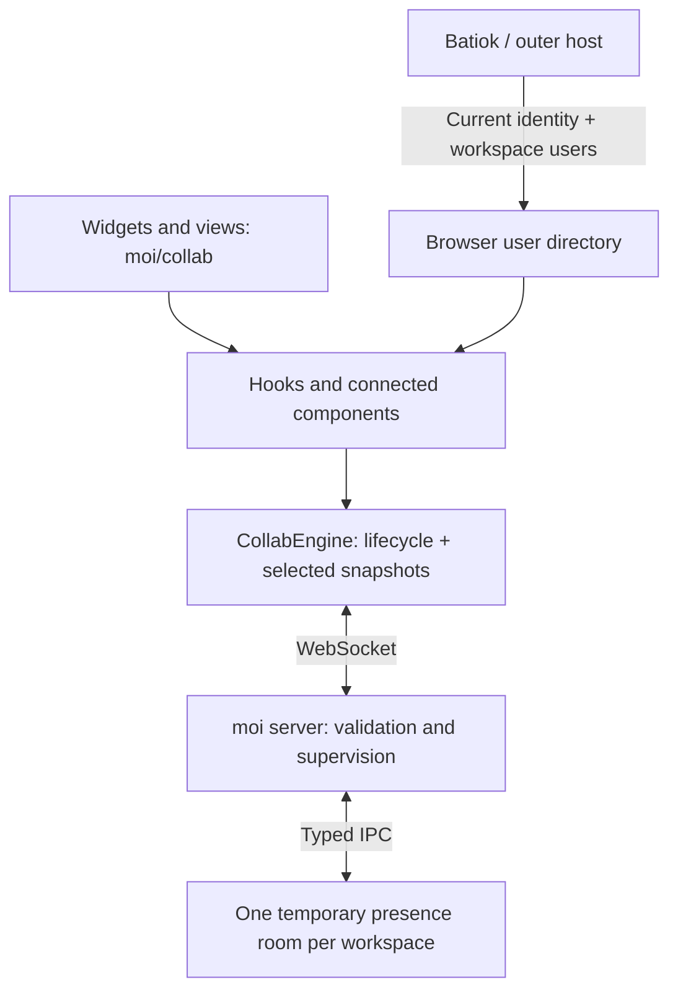

# collab: experimental presence

Status: experimental implementation, updated 2026-09-27.

## Scope

collab supplies workspace users, live presence, cursors, focus, and selection to widgets and
views through `moi/collab`. Everyone connects to the same running moi server. A workspace has
one supervised presence subprocess; it keeps connections and presence in memory only.

Persistent shared applet data and realtime query/mutation synchronization are outside this PR.
There is no collaboration database, mutation endpoint, optimistic write queue, or receipt API.
Existing experimental `.moi/data/collab.sqlite` files are left untouched and are no longer opened.

```mermaid
flowchart TB
  Host["Batiok / outer host"] -->|"Current identity + workspace users"| Directory["Browser user directory"]
  Applets["Widgets and views: moi/collab"] --> Hooks["Hooks and connected components"]
  Directory --> Hooks
  Hooks --> Engine["CollabEngine: lifecycle + selected snapshots"]
  Engine <-->|WebSocket| Main["moi server: validation and supervision"]
  Main <-->|Typed IPC| Room["One temporary presence room per workspace"]
```

The existing applet bridge passes the host's actual hook and component functions into each
separately compiled bundle. Those functions read the host's workspace and applet React contexts.
React receives one `CollabEngine` per mounted workspace through `CollabProvider`. The engine owns
transport lifecycle and exposes stable people and channel snapshots, so cursor-only traffic does not
rerender profile readers or unrelated channels. Transport and registration storage remain private
implementation details. `AppletScope` supplies only the surface and active mount lifetime. There is
no separate enabled context or backend adapter; the playground supplies the same engine contract.

## Enable and install

- `moi start --experimental-collab` enables live presence for this server process.
- `moi start --dev --experimental-collab` enables it under the dev supervisor.
- `moi start` disables live presence, even after a previously enabled start.
- `moi init --experimental-collab` separately installs the optional applet guide and types.

Only command-line flags enable collaboration; environment variables and config files cannot enable it.
The launcher forwards the runtime flag to its child server, including after development and update restarts.
Startup configuration exposes `experimentalCollab` through `/api/config`. The app loads it before
React mounts and refreshes it on workspace-event reconnect. Workers start lazily.

The API remains available with presence disabled: applets still render, user profiles can resolve,
peer/presence lists are empty, and publication is inert. No presence socket is opened. A mounted
applet gets the same context shape in either mode.

If an applet has no host bridge, or its bridge has been disposed, `moi/collab` warns once per
bundle. User lookup returns `null`, list hooks return `[]`, publication does nothing, and every
collaboration component renders nothing, including wrapper children. A disabled runtime still
provides a bridge and keeps ordinary applet rendering available.

Identity starts as `null`. Local development uses an explicit profile from `/dev/collab`, stored
in that browser tab's `sessionStorage`. An outer provider owns identity once injected, including
when it signs out. Applets cannot set identity. Without an identity there is no presence connection.

## Users and connections

A user profile is `{ id, name?, color, avatar?, email? }`. ID and color are required. Names may be
omitted or empty; built-in labels fall back from a nonblank name to email, then ID, without changing
the profile returned by hooks. IDs are stable attribution identifiers;
profiles and browser injection do not provide authentication or workspace access enforcement.
Those policies remain the outer host's responsibility.

A connection is `{ connectionId, userId, location, presence }`. One user can have multiple browser
tabs. The server assigns connection IDs. `location` is `{ page, title?, away? } | null`. Hidden tabs retain their page with
`away: true`; `null` means the connection has no known page. A page is the route segment within the workspace. Status is aggregated across a
user's workspace connections:

- `active`: at least one connection with a known page and `away` absent or false.
- `away`: connected, but no visible connection with a known page.
- `offline`: no connection in this workspace.

Being on a different page does not make someone offline. `usePeers()` defaults to the current
page, deduplicates by user ID, and excludes the current user across all their connections.
Hidden peers remain members of their page, so `usePeers({ status: 'away' })` works with the default
page scope. `scope: 'workspace'` includes other pages too. Status reflects tab visibility, not idle time
or window focus. Hidden connections have no visible cursor/focus/selection markers.
Presence values remain per connection and exclude only the observing connection, so another tab
of the same user can still have its own pointer.

Batiok atomically publishes `{ identity, workspaces }` through `window.moi.collab.setHostState`.
Identity is global across all workspaces; each directory has an explicit `loading` or `ready` state.
The global identity profile replaces its own row in every ready directory which includes that ID,
without adding missing membership. Sign-out clears all directories in the same update.

Batiok's full workspace directory is authoritative when supplied. It allows resolving an offline
user, including someone who has never opened the workspace. Profile replacement and removal take
effect immediately; live connections cannot resurrect removed directory entries. With no host
directory, current connection profiles and the local identity provide a development fallback.
This fallback is transient and makes no promise of resolving users after they leave.

`useMe()` resolves the global identity through the current workspace membership. It returns `null`
while membership loads or when a ready directory omits the viewer. `useWorkspaceUsersStatus()`
distinguishes loading from a ready empty directory; readiness does not imply a live connection.

The complete host integration contract and bootstrap example are in
[batiok-collab-bridge.md](batiok-collab-bridge.md).

## Applet API

| Hook                                 | Contract                                                                                                          |
| ------------------------------------ | ----------------------------------------------------------------------------------------------------------------- |
| `useMe()`                            | Current user profile plus `status`, or `null`.                                                                    |
| `useUser(id)`                        | A profile plus `status`, including offline users; `null` for unknown IDs.                                         |
| `useWorkspaceUsersStatus()`          | Host directory readiness: `unavailable` (live/dev fallback), `loading`, or `ready` (possibly empty).              |
| `useWorkspaceUsers({ status? })`     | Complete workspace directory, including self and offline members; optional `active`, `away`, or `offline` filter. |
| `usePeers({ scope?, status? })`      | Other connected users; `scope` is `page` or `workspace`, `status` is `active` or `away`.                          |
| `usePresence(channel)`               | Read-only array of `{ connectionId, userId, value }` for other connections on this page and applet surface.       |
| `usePublishPresence(channel, value)` | Publish the current JSON value reactively while mounted and visible. Returns nothing.                             |

Reading presence never creates a presence registration. Publication owns one registration per
mounted hook and replaces that registration's whole value. Hidden views, browser tabs, outgoing
builds, unmounts, and Strict Mode cleanup release registrations. Presence is restored after reconnect.
Custom channel names are scoped by applet surface (`view:<name>` or `widget:<name>`); they are not
a persistent key/value store. Channel values must be JSON and fit within 4 KiB.

| Component        | Contract                                                                                |
| ---------------- | --------------------------------------------------------------------------------------- |
| `User`           | Resolve a profile by `id`; name/avatar, sizes, optional status and detail.              |
| `Facepile`       | Resolve `ids` and render stacked avatars with an overflow count.                        |
| `Activity`       | Show current-page or workspace participants.                                            |
| `Cursors`        | Wrap a cursor surface; optional stable `surface` name.                                  |
| `PresenceFrame`  | Wrap one element with a stable local `id`; outline it when another user focuses inside. |
| `PresenceGutter` | The same single-element focus contract, with avatars beside it.                         |
| `PresenceGroup`  | Require `id`, namespace descendant targets, and constrain gutter avatar animations.     |
| `Selection`      | Supply a local `id` and controlled `selected` boolean within the same group namespace.  |

Frame and gutter discover focus through presence and share the same target channel. Each accepts
exactly one React element, including a label or composed component with nested controls; fragments,
arrays, text, and absent children are rejected. Nested focus belongs to the nearest target wrapper.
Their `id` identifies the target, not a user or an HTML element. `each` and `target` props are removed;
lists explicitly render one wrapper per item with both a React `key` and a presence `id`.

`PresenceGroup id` composes a namespace with its enclosing groups. A field `id="title"` inside
groups `id="tasks"` and `id="42"` resolves to `tasks/42/title`. Each segment is URI-encoded before
joining, so an ID containing `/` or `%` cannot collide with a different nesting structure. IDs must
be nonblank and stable across browsers, and targets should be unique within their group. Reordering
keeps presence attached to its data; removing a target or changing its ID/group clears the old
registration. Reusing a modal for another record must change its group ID or local target ID.

Groups add no DOM or presence publication; ordinary elements own layout. Each group also has a
separate local animation identity so avatars do not glide between unrelated rendered groups which
happen to share semantic IDs. Page and applet isolation remain outside this namespace. Group IDs
scope frame, gutter, and selection targets; custom presence channels and cursor surface names keep
their existing applet scope. Built-in target wrappers also provide the resolved cursor anchor.

`useWorkspaceUsers` enumerates the full host directory, while `usePeers` enumerates connections
deduplicated by user. The workspace header shows connected users (active or away) only; its member
popover can list offline users too. Without a host directory, enumeration falls back to the local
identity and currently connected profiles, so it cannot discover offline members.

`Cursors` is the public cursor component; the singular cursor renderer is internal. Pointer updates
are coalesced to 50 ms. Optional `data-collab-target` anchors allow pointers to follow an element
when layouts or scroll positions differ; arbitrary canvas coordinate mapping is not implemented.

Public declarations: [collab-env.d.ts](../server/collab/skill/collab-env.d.ts).
Authoring guide: [COLLABORATIVE.md](../workspace/.claude/skills/moi-workspace/references/COLLABORATIVE.md).

## Transport and lifecycle

Protocol version 2 accepts an identified `join`, profile updates, location updates, presence registration
updates/removals, and ping. It sends welcome, participant/profile snapshots, errors, and pong.
Profiles in socket snapshots are only a fallback for current connections; the full host directory
is never sent through this socket.

The main server owns sockets, validates messages, enforces payload limits, and supervises one
subprocess per canonical workspace path. The process owns participants and temporary registrations.
No persistent storage is opened. Each workspace supports up to 64 browser connections and each connection supports up to 128 active
presence registrations, with a 4 KiB value limit per registration. Unfocused controls do not consume
registrations. Limits count browser connections and active publishers, not directory members.
Slow sockets are disconnected when reliable delivery cannot be maintained, including when a participant
snapshot cannot be delivered. Reconnect repairs the full snapshot so a dropped final departure cannot
leave ghost presence alive behind healthy heartbeats.

Worker failure closes its sockets. Clients reconnect with backoff, join afresh, and republish live
presence. Shutdown and parent IPC loss terminate children. Applet rebuilds and function-worker
restarts do not restart presence. Idle workers can exit; active rooms are preserved.

With runtime and identity enabled, selected chats and open/current tabs are browser-tab-local.
Local applet navigation and main's targeted navigation relay update the selected browser. Personal
selection does not write shared tab/chat selection. Ordinary navigation behavior remains when no
identity is supplied. Share invokes the outer host's handler,
or copies the workspace URL if none exists; copying does not grant access or publish a workspace.

## Development and verification

`/dev/collab` combines explicit dev identity setup with an isolated presence playground. The
playground works without enabling runtime, opening a workspace, or creating an identity. It uses
the same hooks, components, and selected snapshots with a fake engine and fixture directory. Reopening
it resets its state; other browser tabs have independent fake rooms.

Use real workspace applets in two browsers to verify transport: joins/leaves, duplicate user tabs,
profile updates/removals, read-only presence, focus/selection/cursors, hidden tabs, view switches,
rebuild cleanup, reconnection, and workspace isolation. Disabled-mode applets must render without
opening a socket. Unit/integration tests cover directory ownership, protocol validation, room
cleanup, process supervision, store recovery, and public declarations.

A later realtime-data proposal may build on server functions and query invalidation. No part of
that design is implemented or exposed by this PR.
