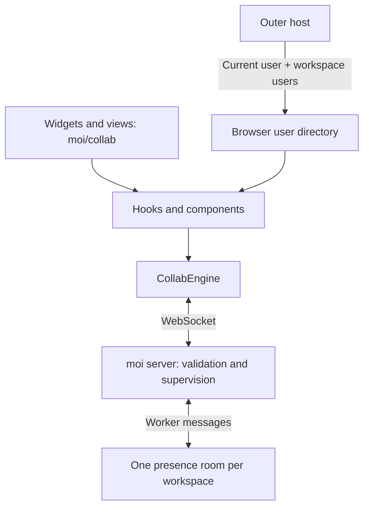

# collab: experimental presence

collab adds workspace users and live presence to widgets and views through `moi/collab`.
Everyone connects to the same running moi server. Presence stays in memory; applet content
continues to use existing server functions and storage.

- [Applet guide](../workspace/.claude/skills/moi-workspace/references/COLLAB.md): hooks,
  components, and stable presence IDs. Installed in workspaces that opt in.
- [Public types](../server/applets/declarations/collab.d.ts): the applet API contract.
- [Host bridge](collab-host-bridge.md): current user, membership, and profile updates.

## Enable and install

`moi start --experimental-collab` enables live presence. Add `--dev` to use the development
supervisor. `moi init --experimental-collab` separately installs the optional applet guide and
public types. See [Experimental features](experimental-features.md) for flag registration and
restart behavior.

The app loads `experimental.collab` from `/api/config` before React mounts and refreshes it on
workspace-event reconnect. Presence workers start lazily. With presence disabled, applets still
render and resolve user profiles; peer/presence lists are empty, publication is inert, and no
presence socket opens.

Without a host bridge, or after its disposal, `moi/collab` warns once per bundle. User lookups
return `undefined`, lists return `[]`, and components render nothing, including wrapper children.
A disabled runtime still supplies a bridge.

The current user starts as `undefined`. `/dev/collab` can set a local test user in the browser
tab's `sessionStorage`. An outer host owns the current user once injected, including sign-out.
Without a current user there is no presence connection.

## Architecture


```mermaid
flowchart TB
  Host["Outer host"] -->|"Current user + workspace users"| Directory["Browser user directory"]
  Applets["Widgets and views: moi/collab"] --> Hooks["Hooks and components"]
  Directory --> Hooks
  Hooks --> Engine["CollabEngine"]
  Engine <-->|WebSocket| Main["moi server: validation and supervision"]
  Main <-->|Worker messages| Room["One presence room per workspace"]
```

The applet bridge passes the host's hook and component functions into separately compiled bundles.
`CollabProvider` supplies one [engine](../client/features/collab/engine.ts) per mounted workspace.
The engine owns transport and stable user/channel snapshots, so pointer traffic does not rerender
unrelated readers. `AppletPresenceProvider` supplies the applet ID (`views/<name>` or
`widgets/<name>`) and active lifetime.

The [user directory](../client/features/collab/users.ts) resolves profiles and aggregates status
across a user's connections. Status tracks tab visibility, not idle time or window focus.
A supplied host directory determines membership, including offline users. Socket profiles provide
only a fallback when no directory is supplied; the directory never travels through the socket.

## Cloudflare Access

A deployment behind Cloudflare Access can use verified viewer profiles. Configure both fields in
`config.json` in moi's data directory:

```json
{ "cloudflareAccess": { "teamDomain": "acme.cloudflareaccess.com", "audience": "<AUD tag>" } }
```

The environment equivalents are `MOI_CLOUDFLARE_ACCESS_TEAM_DOMAIN=acme` and
`MOI_CLOUDFLARE_ACCESS_AUD=<tag>[,<tag>]`; they override config per field. A partial configuration
is ignored with a warning. The team domain accepts a team name, host, or HTTPS URL.

[Token verification](../server/collab/cloudflare-access.ts) checks the Access JWT's signature,
issuer, audience, and expiry. User profiles come from `sub` and `email`; service tokens supply
no user. `GET /api/proxy-user` returns `{ provider, profile }` with caching disabled. The app loads
it before mounting and after reconnect. A configured proxy replaces local test users; without a
valid user token, the tab stays signed out.

The socket upgrade also verifies the token and rejects unauthenticated requests. The server
requires the verified user ID and replaces submitted profiles with the verified profile.
An outer host still owns the browser's current user, whose ID must match the token.
Access supplies no workspace directory; membership display uses the live fallback unless the host
supplies one. Deployment access controls remain separate from this display data.

## Presence and lifecycle

Each publishing hook owns one registration and replaces its whole value. Hidden browser tabs,
parked views, outgoing applet builds, and unmounts release registrations. Reconnect restores live
presence. Readers never create registrations.

[Presence targets](../client/features/collab/presence-target.ts) encode each group/field ID segment
before joining it, avoiding collisions between nesting and IDs containing slashes. Groups also
have a local animation identity so avatars do not move between unrelated rendered groups.
Frame and gutter wrappers supply cursor anchors. Pointer updates are coalesced to 50 ms;
anchors let pointers follow elements across different layouts and scroll positions.

[Protocol version 1](../lib/collab/types.ts) carries profiles, locations, presence updates/removals,
and heartbeats. The [main server](../server/collab/manager.ts) owns sockets, validates messages,
and supervises one subprocess per canonical workspace path. The [room](../server/collab/service.ts)
keeps connections and registrations in memory. Limits in [protocol.ts](../lib/collab/protocol.ts)
allow 64 connections per workspace, 128 registrations per connection, and 4 KiB per presence value.
These count browser tabs and active publishers; unfocused controls consume no registrations.

Slow sockets disconnect when reliable delivery cannot be maintained. Reconnect replaces the full
snapshot to clear stale presence. Worker failure closes its sockets; clients reconnect with backoff
and republish. Shutdown and parent process loss terminate children. Idle workers can exit; applet
rebuilds and function-worker restarts do not restart an active presence room.

With collab enabled and a current user, selected chats and workspace tabs use
[browser-tab state](../client/features/collab/browser-tab-state.ts). Otherwise selection stays
shared. See [Workspace navigation](navigation.md) for routing and targeted CLI navigation.
Share calls the host's handler or copies the workspace URL; copying does not grant access.

## Development and verification

`/dev/collab` includes local test user setup and an isolated playground. The playground uses the
same engine contract with fixtures, works without a live workspace, and resets on reopening.
Each browser tab has its own fake room.

Verify real transport in two browsers: multiple tabs for one user, profile updates/removals,
focus/selection/cursors, hidden tabs, view switches, rebuild cleanup, reconnect, and workspace
isolation. Check directory loading, offline users, and applet rendering with presence disabled.
Tests cover directory ownership, protocol validation, room cleanup, process supervision,
store recovery, and public declarations.
