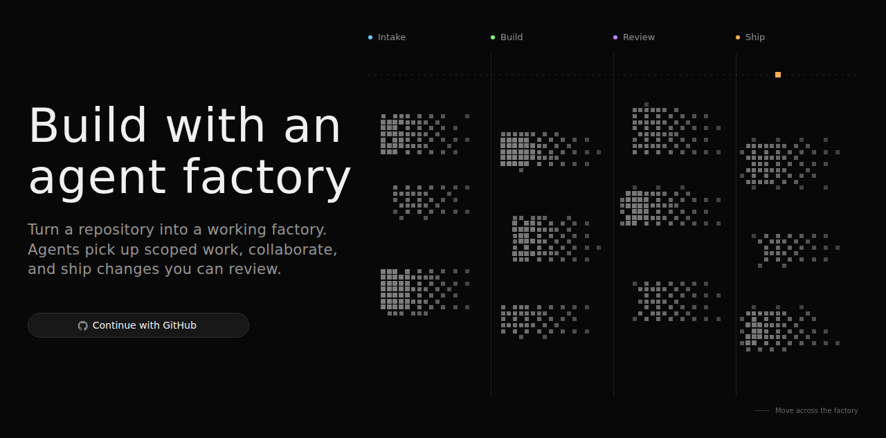
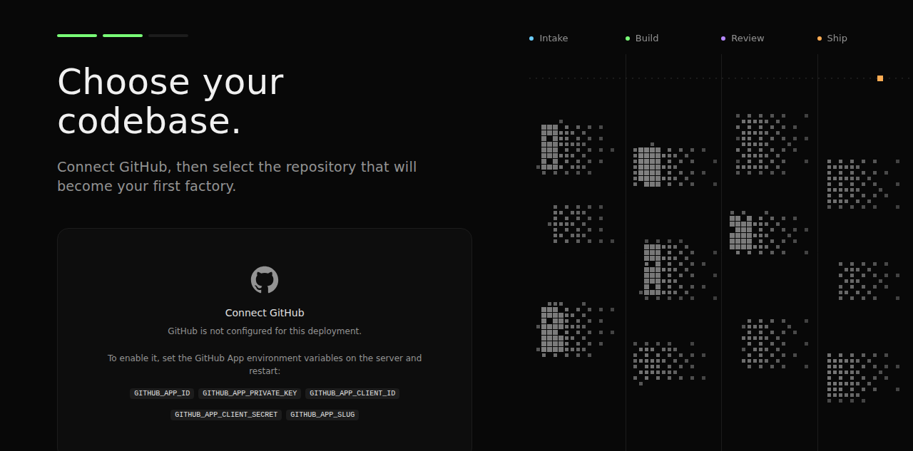

# Trying `npm create factory` (Mastra Factory)

Field notes from scaffolding and booting **Mastra Factory** — the "build your
factory today" launch (`create-factory` on npm, first published 2026-07-17).
It scaffolds a self-hostable, agent-powered software delivery web app from
[mastra-ai/softwarefactory-template](https://github.com/mastra-ai/softwarefactory-template):
GitHub/Linear issues land on an intake board, coding agents work them in
sandboxes, pull requests come out the other side. Intake → Build → Review →
Ship.

The scaffolded app is **not** committed (it is a few hundred files of
template source with its own git history). Reproduce with:

```sh
cd experiments
bunx create-factory mastra-factory --no-platform
```

`--no-platform` skips Mastra platform sign-in and Neon provisioning. Then
`bun run dev` serves UI + API on http://localhost:4111. Zero external
services needed to boot: libSQL file storage, a local git sandbox, and an
in-process event bus stand in for Postgres/Redis/Railway.



## How it relates to the harness

The factory is the productized layer **on top of** the `AgentController`
(ex-Harness) explored in `../mastra-harness/`: the SPA's data layer is a wall
of `useAgentControllerThreads` / `useAgentControllerModes` /
`useAgentControllerPermission*` hooks, and the server wires one controller
(`id: 'code'`) built by `MastraFactory` from `@mastra/factory`. The whole
app entry is ~200 lines mapping env vars onto `MastraFactory` slots —
storage (Postgres or libSQL), pubsub (Redis or in-process), sandbox
(Railway/platform or local), auth (platform, WorkOS, or none).

## Findings

**Auth-less mode ships broken in template 0.1.0.** The README promises
"zero configuration → local, auth-less mode", but:

- `--no-platform` does not set `MASTRACODE_AUTH_DISABLED=1`, so the default
  platform auth installs and every page 401s.
- With the flag set, the SPA spins forever: `/auth/me` is unmounted, but the
  server's catch-all answers it with **200 + HTML** instead of the 404 the
  SPA's degrade path expects (`fetchAuthState` only treats 404 as
  "auth disabled"), so the auth query errors and retries every 2s. The
  intended `__MASTRACODE_CONFIG__.authEnabled=false` short-circuit is only
  injected by the separate Vite dev path, not by `mastra factory dev`.
- Even past the spinner, all `/web/factory/*` routes require a tenant —
  `auth: null` makes the factory feature surface permanently 401. Auth-less
  mode is effectively agents-only, not the full app.

**Self-hosted identity is two lines away.** The template deps include
`@mastra/auth-better-auth` but never wire it. Adding this to
`src/mastra/index.ts` gives working email/password sign-up/sign-in (the
SPA's `/signin` page already speaks the better-auth protocol), tables
auto-migrate onto the factory storage, and the full app surface unlocks:

```ts
import { MastraAuthBetterAuth } from '@mastra/auth-better-auth'

if (authDisabled) {
  auth = null
} else if (process.env.BETTER_AUTH_SECRET?.trim()) {
  auth = new MastraAuthBetterAuth({ secret: process.env.BETTER_AUTH_SECRET.trim() })
}
```

plus `BETTER_AUTH_SECRET=<random 32+ chars>` in `.env`. After that:
account creation works, `/auth/me` returns
`{"authenticated":true,...,"provider":"better-auth"}`, and the real
onboarding wizard appears.

**The hard wall is the GitHub App.** Step 2 of the wizard ("Choose your
codebase") requires a GitHub App you own — `GITHUB_APP_ID`,
`GITHUB_APP_PRIVATE_KEY`, `GITHUB_APP_CLIENT_ID`, `GITHUB_APP_CLIENT_SECRET`,
`GITHUB_APP_SLUG`. There is no PAT fallback in the wizard (the `/web/github/pat`
routes serve git operations after a connection exists). Creating the app is
an interactive github.com flow, so the full intake → agent → PR loop needs
that one-time setup plus a model provider key (added in Settings › Models or
`ANTHROPIC_API_KEY`).



## Verdict

The scaffold-to-running-UI path is genuinely fast (one command, one `dev`
script, no Docker required), and the architecture is the interesting part
for moi: it is what a multi-tenant, deployable host around an agent
controller looks like — same shape as moi's server + workspace model, with
intake boards and PR shipping bolted on. The rough edges are all in the
brand-new auth-less/self-hosted path, which tracks for a package that was
six days old when tested.
